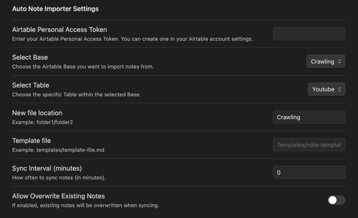

# Auto Note Importer


Easily import and sync notes from an external database like Airtable into your Vault.  
Customize destination folders, apply templates, and manage syncing with flexible settings.

<br>

## ✨ Features

- Pulls notes from Airtable (more database support planned)
- Creates Markdown files with structured YAML metadata
- **🔗 Obsidian Bases Compatible**: Clean YAML properties work well with Bases table/card views
- Supports manual and scheduled syncing (configurable interval)
- Customizable:
  - Destination folder
  - Note template
  - Overwrite option
- Handles missing folders by auto-creating them
- Minimal setup, zero coding required!

<br>

## 📦 Installation

1. Open Obsidian.
2. Go to **Settings > Community plugins > Browse**.
3. Search for "**Auto Note Importer**" and install it.
4. Enable the plugin.
5. Configure your Airtable PAT and Base/Table settings.

<br>

## 🚀 Usage

- **Manual Sync**:
  - Use the Command Palette (`Ctrl+P`) → search for **"Sync Notes Now"** to trigger manual sync.
- **Auto Sync**:
  - Set a sync interval (minutes) in settings.
  - If set to `0`, auto sync will be disabled (manual only).

<br>

📺 **Watch the 30-second install guide:**

<video src="https://github.com/user-attachments/assets/9944368b-1ec2-496a-a216-3c01edb54589" controls width="100%"></video>

<br>

## Filename Generation
- By default, notes are saved using the value from the Airtable field specified in the **Filename Field Name** setting (defaults to `title`).
- If the field specified in **Filename Field Name** is missing or empty in a record, or if the setting itself is empty, the plugin will use the value from the **Primary Field** as the note filename.
- **Important:** The **Primary Field** is the field specified in the **Primary Field Name** setting. If that setting is empty, it defaults to the value from the **very first column** in your Airtable table.
- Filenames are automatically sanitized to remove characters that are not allowed in filenames.

<br>

## Duplicate Note Handling

- **Important:** The **Primary Field** (the field specified in the **Primary Field Name** setting, or the first column if empty) is used as a unique identifier for each note.
- When the `Allow Overwrite Existing Notes` setting is **disabled** (the default):
  - The plugin checks the YAML frontmatter (`primaryField: value`) of existing notes in the target folder.
  - If a note with the same `primaryField` value already exists, the incoming note from Airtable will be **skipped** to prevent duplicates.

<br>

### Important Note on `primaryField` in Frontmatter

To ensure reliable duplicate note detection (especially when `Allow Overwrite Existing Notes` is disabled), this plugin relies on a `primaryField` key in the YAML frontmatter of your notes.

- **Automatic Injection:** If you use a custom template, the plugin will check the generated note content. If a YAML frontmatter block (`---`) exists but is missing the `primaryField:` key, **the plugin will automatically add it**. If your template does *not* contain a frontmatter block at all, the plugin will **create a minimal frontmatter block** at the top of the note, containing only the `primaryField`.
- **Fixed Key Name:** The key name used for this purpose is always `primaryField`. This is used internally by the plugin and cannot be changed in the settings.
- **Purpose:** This ensures that even if you later disable the "Allow Overwrite" setting, the plugin can correctly identify existing notes based on their unique primary field value.

<br>

## ⚙️ Settings



| Setting | Description |
|:---|:---|
| Airtable Personal Access Token | Personal Access Token for Airtable API |
| Select Base | Select the Airtable Base to fetch records from (Requires valid PAT) |
| Select Table | Select the Airtable Table inside the Base (Requires valid PAT and selected Base) |
| New file location | Where imported notes are saved in your Vault (Suggests existing folders) |
| Primary Field Name | (Optional) The Airtable field name to use as the unique identifier for duplicate checking.<br>Defaults to the first field if left empty. |
| Filename Field Name | (Optional) The Airtable field name to use for the note's filename.<br>Defaults to `title`. Falls back to the Primary Field if empty or not found. |
| Template file | (Optional) Path to a template Markdown file (Suggests existing Markdown files). See **Template Usage** below. |
| Sync Interval (minutes) | Interval (in minutes) for auto-sync (0 = no auto sync) |
| Allow Overwrite Existing Notes | If enabled, existing notes with the same filename will be overwritten. If disabled, notes with the same `primaryField` value in their frontmatter will be skipped (see **Duplicate Note Handling**). |

<br>

## Airtable Field Type Support

This plugin attempts to fetch and represent various Airtable field types within your Obsidian notes, primarily through the template system (`{{fieldName}}`). Here's how different types are generally handled:

| Field Type             | API Data Example                      | Template Output (`{{Field}}`) | Notes & Usage Tips                                                                                                                               |
| :--------------------- | :------------------------------------ | :---------------------------- | :----------------------------------------------------------------------------------------------------------------------------------------------- |
| **Text Types**         |                                       |                               |                                                                                                                                                  |
| Single line text       | `"Short text"`                        | `Short text`                  | Outputs the text directly.                                                                                                                       |
| Long text              | `"Line 1\nLine 2"`                    | `Line 1\nLine 2`              | Outputs the text, preserving line breaks. Use YAML block scalar for multi-line frontmatter.                                                  |
| Email                  | `"test@example.com"`                  | `test@example.com`            | Outputs the email address text.                                                                                                                  |
| URL                    | `"https://obsidian.md"`               | `https://obsidian.md`         | Outputs the URL text. Use Markdown syntax `{{Field}}` in template for a clickable link.                                             |
| Phone number           | `"+15551234567"`                      | `+15551234567`                | Outputs the phone number text.                                                                                                                   |
| **Number Types**       |                                       |                               |                                                                                                                                                  |
| Number                 | `123.45`                              | `123.45`                      | Outputs the number as text.                                                                                                                      |
| Currency               | `99.99`                               | `99.99`                       | Outputs the numerical value. Currency symbol is not included by default.                                                                         |
| Percent                | `0.75`                                | `0.75`                        | Outputs the decimal value (e.g., 75% is 0.75).                                                                                                   |
| Rating                 | `4`                                   | `4`                           | Outputs the rating number.                                                                                                                       |
| Autonumber             | `101`                                 | `101`                         | Outputs the unique number.                                                                                                                       |
| **Date & Time**        |                                       |                               |                                                                                                                                                  |
| Date                   | `"2023-10-27"` / `"2023-10-27T10:00Z"` | `2023-10-27` / `2023-10-27...`| Outputs the date/time as an ISO 8601 string. Compatible with Obsidian/Dataview YAML date fields.                                              |
| Created time           | `"2023-10-27T10:00:00.000Z"`          | `2023-10-27T10:00:00.000Z`    | Outputs the timestamp string.                                                                                                                    |
| Last modified time     | `"2023-10-27T11:30:00.000Z"`          | `2023-10-27T11:30:00.000Z`    | Outputs the timestamp string.                                                                                                                    |
| Duration               | `3665` (seconds)                      | `3665`                        | Outputs the duration in seconds. Use Airtable Formula field for human-readable format if needed.                                                 |
| **Choice Types**       |                                       |                               |                                                                                                                                                  |
| Single select          | `"Option B"`                          | `Option B`                    | Outputs the selected option text.                                                                                                                |
| Multiple select        | `["Option A", "Option C"]`            | `[Option A, Option C]`        | Outputs a string representation of the array (e.g., `"[Option A, Option C]"`). Suitable for YAML lists if format matches.                       |
| Checkbox               | `true`                                | `true`                        | Outputs `"true"` or `"false"` string. Compatible with Obsidian/Dataview YAML boolean fields.                                                   |
| **Relational Types**   |                                       |                               |                                                                                                                                                  |
| Link to another record | `["recXXX", "recYYY"]`                | `[recXXX, recYYY]`            | Outputs a string representation of the linked record ID array. **Recommendation:** Use a `Lookup` field in Airtable to get meaningful data. |
| Lookup                 | *Depends on lookup*                   | *Depends on lookup*           | Output depends on the looked-up field type (text, number, array). Handled like the original type. Arrays become `"[Value1, Value2]"`.          |
| Rollup                 | *Depends on rollup*                   | *Depends on rollup*           | Output depends on the aggregation result (number, date, array). Handled like the result type. Arrays become `"[Value1, Value2]"`.             |
| Count                  | `3`                                   | `3`                           | Outputs the count number.                                                                                                                        |
| **Attachment & User**  |                                       |                               |                                                                                                                                                  |
| Attachment             | `[{id:"att...", url:"...", ...}]`     | `[Object]`                    | Use **dot notation** for details: `{{Attachment.0.url}}`, `{{Attachment.0.filename}}`. Direct use outputs `[Object]`.                          |
| User                   | `{id:"usr...", email:"...", name:"..."}` | `[Object]`                    | Use **dot notation** for details: `{{UserField.name}}`, `{{UserField.email}}`. Direct use outputs `[Object]`.                               |
| Created by             | `{id:"usr...", ...}`                  | `[Object]`                    | Use dot notation: `{{Created by.name}}`.                                                                                                         |
| Last modified by       | `{id:"usr...", ...}`                  | `[Object]`                    | Use dot notation: `{{Last modified by.name}}`.                                                                                                   |
| **Special Types**      |                                       |                               |                                                                                                                                                  |
| Barcode                | `{text: "123"}`          | `[Object]`                    | Use dot notation: `{{BarcodeField.text}}`.                                                                                                       |
| Button                 | *N/A (UI only)*                       | *N/A*                         | Button fields are UI elements in Airtable and do not return data via the API.                                                                    |
| Formula                | *Depends on formula*                  | *Depends on formula*          | Output depends on the formula result type (text, number, date, boolean, array). Handled like the result type.                                    |

**Note:** For fields returning arrays or objects, using them directly in the template (`{{FieldName}}`) might result in simplified representations like `"[Value1, Value2]"` or `[Object]`. Use **dot notation** (e.g., `{{ArrayField.0}}`, `{{ObjectField.propertyName}}`) within your template to access specific elements or properties as needed. See the **Template Usage** section for more examples.

<br>

## 🔄 Example Workflow

1. Use **n8n** to collect and summarize YouTube video information.
2. Store the processed summaries into **Airtable**.
3. Launch **Obsidian**, and use this plugin to fetch and create beautiful Markdown notes!

<br>

## Template Usage

If you specify a `Template file`, the plugin will use its content to create new notes. You can use placeholders in the template file that will be replaced with the actual data from your Airtable record.

Use double curly braces `{{ }}` around the **field name** from your Airtable table. For example:

**Accessing Nested Fields:**

For complex fields like `Attachment` or `User` (which are often arrays or objects), you can access nested properties using **dot notation**.

- To get the URL of the *first* attachment: `{{Attachment.0.url}}`
- To get the name of the *first* user in a User field: `{{Assignee.0.name}}` (if multiple users allowed) or `{{Assignee.name}}` (if single user)
- To get the text value from a Barcode field: `{{My Barcode.text}}`

**Comprehensive Template Example:**

For a detailed example demonstrating how to use various Airtable field types (including nested access for Attachments, Users, Barcodes, and multi-line text handling in frontmatter), please see the example file:

**➡️ [View Template Example File](examples/template-example.md)**

If a field referenced in the template (e.g., `{{summary}}`) doesn't exist in a specific Airtable record, it will be replaced with an empty string.
If you try to access a field that is an Array or Object directly without specifying a nested property (e.g., `{{Attachment}}`), it will be rendered as `[Object]` or a string representation like `[Value1, Value2]`. Use dot notation for specific values.

<br>

## 🔗 Obsidian Bases Compatibility

This plugin works well with **Obsidian Bases** (the new database feature):

### ✨ **What Works**
- **YAML Properties**: All imported metadata appears as editable properties in Bases
- **Field Types**: Numbers, dates, booleans, and text fields display correctly in table view
- **List Format**: Arrays are formatted as Bases-compatible lists when possible
- **Structured Data**: Clean metadata organization for database-style workflows

### 📊 **Usage with Bases**
1. Import your notes using Auto Note Importer
2. Enable the **Bases** plugin
3. Create a new base from your imported notes folder
4. View and edit your data in table or card format

<br>

## 📝 Default Note Template Example

If no custom template is provided, notes will be created with this structure:

```markdown
---
primaryField: "Value from primary field (for duplicate detection)"
title: "Your Note Title"
created: 2025-08-31
status: imported
# ... all your Airtable fields with proper types for Bases editing
---


## Description
Your content here...
```

<br>

## 🛠️ Planned Features

- [x] Pagination support for large Airtable datasets
- [x] Flexible field mapping (choose which field to treat as unique/primary key)
- [x] Expanded Airtable field type support & documentation (See "Airtable Field Type Support" section)
- [ ] Support multi-database (Airtable, Supabase, Notion DB, Custom API)
- [x] Progress indicator during sync
- [ ] Internationalization (i18n) support for multiple languages
- [ ] Advanced overwrite/merge strategies
- [ ] UI/UX improvements in settings panel
- [ ] Multi-Base/Table Configuration
  - Support independent settings for multiple Airtable Bases/Tables (Base/Table/Primary Field/Filename Field/File Location/Template File/Sync Interval/Overwrite). Each configuration will also have its own manual sync command.
- [ ] Table-Level Import (Full Table Export)
  - Instead of importing one row as one note, allow exporting the entire table as a single Markdown table-formatted note.
- [ ] Sync Log File Generation
  - Generate a log file during sync to record when and what data was synchronized.
- [ ] Field-Template Mapping UI
  - Improve UI to allow users to specify which field to use as Filename Field or Primary Field per table.
- [ ] Filter/Query Conditions
  - Add filtering options to import only records that match specific conditions (e.g., completed rows, rows created within the last 30 days).
- [ ] Advanced Field Type Conversion
  - Automatically download attachments (save locally), auto-link URLs, and other advanced transformations
- [ ] Compatibility Options for Obsidian Plugins
  - Provide format options compatible with other Obsidian plugins like Dataview and Templater (e.g., optimized YAML format, auto tagging, etc.).

<br>

## ☕ Support

If you find this plugin useful, you can support the development:

<div style="display: flex; gap: 20px; align-items: center;">
  <a href="https://ko-fi.com/uppinote" target="_blank">
    
  </a>
  <a href="https://www.buymeacoffee.com/uppinote" target="_blank">
    
  </a>
</div>

<br>

## 📄 License

MIT License