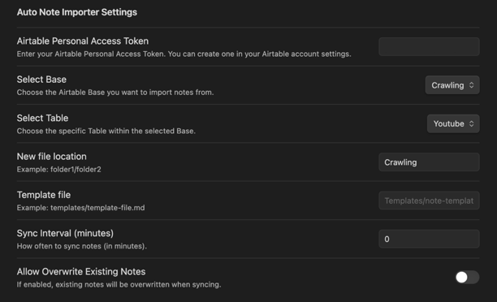
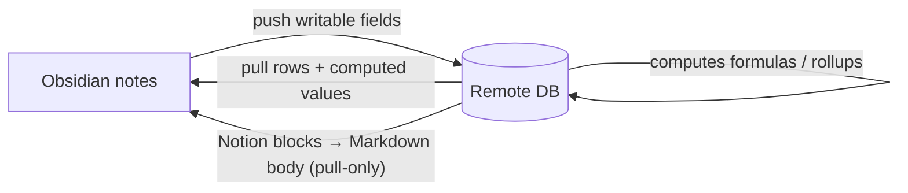

# Auto Note Importer


**Two-way sync between your databases and your Obsidian vault.** Point it at Airtable, SeaTable, Supabase, or Notion — it pulls rows in as notes, pushes your edits back, and keeps computed fields fresh.

| Provider | Pull → notes | Push edits back | Computed fields | Page body |
|:---|:---:|:---:|:---:|:---:|
| **Airtable** | ✅ | ✅ | ✅ formula / rollup / lookup | — |
| **SeaTable** | ✅ | ✅ | ✅ formula / link-formula | — |
| **Supabase** | ✅ | ✅ | ✅ generated columns | — |
| **Notion** | ✅ | ✅ page properties | ✅ formula / rollup | ✅ blocks → Markdown (pull) |

Built on a provider-agnostic core — every provider gets the same multi-config, conflict-resolution, and safety machinery.



## ✨ Highlights

- **Sync your way** — manual commands, scheduled intervals, or auto-sync on file change; several configurations (different bases / tables / folders) run side-by-side
- **Bidirectional & conflict-aware** — push frontmatter edits back, resolve collisions with `Manual` / `Obsidian wins` / `Remote wins`, and auto-refetch server-computed values after a push
- **Safe by default** — read-only and object-shaped fields never get clobbered; filename/subfolder pickers only offer types that make valid names; unknown types fail closed
- **Notes that feel native** — `{{field}}` templates (incl. `{{body}}` for Notion page content), subfolder organization by field value, Bases-friendly YAML frontmatter

## 📦 Installation

1. **Settings → Community plugins → Browse** → search "**Auto Note Importer**" → Install & Enable
2. Add a **credential** for your provider (below), then create a **sync configuration**

## 🚀 Quick Start

**The 3-step shape is the same for every provider:** get a token → add a credential → pick table & folder. Expand yours:

<details>
<summary><strong>Airtable</strong> — Personal Access Token</summary>

1. Visit the [Airtable Tokens page](https://airtable.com/create/tokens) → **Create new token**
2. Scopes: `data.records:read` (import) · `data.records:write` (bidirectional) · `schema.bases:read` (field pickers)
3. Choose your bases → **Create token** → copy the PAT
4. In the plugin: **Add credential → Airtable** → paste → then pick **Base → Table → View (optional) → Filename / Subfolder fields**
</details>

<details>
<summary><strong>SeaTable</strong> — base API token</summary>

1. Open your SeaTable base → **⋯ → Advanced settings → API Tokens → Add API Token** with **Read and write**
2. Copy the token (it is base-specific — one token per base) and note your server URL (`https://cloud.seatable.io` unless self-hosted)
3. In the plugin: **Add credential → SeaTable** → paste token + server URL → pick **Table → View (optional) → Filename / Subfolder columns**
</details>

<details>
<summary><strong>Supabase</strong> — project URL + API key</summary>

1. **Project Settings → API**: copy the **Project URL** and an **API key** — **Publishable** (`sb_publishable_…`) recommended; legacy `anon` JWT also works; secret/service_role bypasses RLS (the plugin auto-detects and warns)
2. Make sure your schema is listed under **Settings → API → Exposed schemas** (`public` already is)
3. In the plugin: **Add credential → Supabase** → paste → pick **Schema → Table → View (optional) → Primary key column → Filename / Subfolder columns** (dropdowns auto-populate from your project's OpenAPI spec)
4. **Publishable-key users**: Supabase blocks schema introspection for publishable keys, so a one-time setup banner appears with a `SECURITY DEFINER` SQL function — **Copy SQL** → run it in the Supabase SQL Editor → **Verify**. Saving is blocked until verified (fail-closed); `anon`/secret keys skip this entirely.
</details>

<details>
<summary><strong>Notion</strong> — internal integration token</summary>

1. Create an internal integration at [notion.so/profile/integrations](https://www.notion.so/profile/integrations) and copy the token (`ntn_…`)
2. **Share your database with the integration**: open the database in Notion → **⋯ → Connections →** add your integration (without this, the plugin sees zero data sources)
3. In the plugin: **Add credential → Notion** → paste the token (**Test connection** reports how many data sources are shared) → pick a **data source** — the filename field auto-fills from the title property
4. Optional: enable **Sync page body (pull-only)** to bring the page content below the properties into the note body as Markdown. ⚠️ The body is pull-only — Notion is the source of truth, and local body edits are overwritten on the next pull (follows *Allow overwrite*).
</details>

Then set the **destination folder**, an optional **template**, and toggle **bidirectional sync** if you want edits flowing back. Multiple configurations switch via the tab bar at the top of the settings panel.

## 🕹 Commands

Every command is labeled with the active config's provider (Ctrl/Cmd + P):

| Command | Description |
|:---|:---|
| **Sync current note from {provider}** | Refresh the active note from the remote |
| **Sync all notes from {provider}** | Import / update everything |
| **Sync current / modified / all to {provider}** \* | Push local frontmatter edits |
| **Bidirectional sync current / modified / all** \* | Push → wait for formulas → pull computed values |

\* Hidden unless **Enable bidirectional sync** is on. Scheduling: **Sync interval** (minutes, 0 = manual) and **Watch for changes** (queue a sync when a note is edited).

## ⚙️ Settings Guide

<details>
<summary><strong>Per-configuration basics</strong></summary>

| Setting | Description |
|:---|:---|
| **Credential** | Pick a registered credential (any provider) |
| **Base / Table / View** | Provider-aware pickers (Airtable Meta API · SeaTable metadata · Supabase OpenAPI · Notion data sources) |
| **Filename field** | Field used for note filenames — only name-safe types are offered |
| **Subfolder field** | Optional — organize notes into `destination/value/` subfolders |
| **New file location** | Destination folder in your vault |
| **Template file** | Optional `{{field}}` template |
| **Sync interval** | Auto-sync frequency in minutes (0 = disabled) |
| **Allow overwrite** | Update existing notes vs skip duplicates |
| **Sync page body** (Notion) | Pull the page's block content into the note body — pull-only, overwrites local body edits |
</details>

<details>
<summary><strong>Bidirectional sync</strong></summary>

| Setting | Description |
|:---|:---|
| **Enable bidirectional sync** | Allow Obsidian → remote pushes |
| **Conflict resolution** | `Manual` (notify & skip) · `Obsidian wins` · `Remote wins` |
| **Watch for file changes** | Auto-queue a push when a synced note is edited |
| **Auto-sync computed fields** | After pushing, pull back formulas / rollups / generated columns |
| **Computed-field sync delay** | ms to wait for the remote to recompute (default 1500) |
</details>

<details>
<summary><strong>Supported field types per provider</strong></summary>

Each provider's native types map to a normalized taxonomy (`text` / `number` / `date` / `boolean` / `single-select` / `multi-select` / `attachment` / `link` / `computed` / `system`). Read-only and object-shaped types are excluded from pushes automatically — fail-closed for anything unknown.

**Airtable** — filename-safe: `singleLineText`, `singleSelect`, `number`, `formula` · read-only: `formula`, `rollup`, `count`, `lookup`, `externalSyncSource`, `aiText`, `button`, `createdTime`, `lastModifiedTime`, `createdBy`, `lastModifiedBy`, `autoNumber` · [full reference →](examples/airtable-field-types.md)

**SeaTable** — filename-safe: `text`, `single-select`, `number`, `auto-number`, `formula` · read-only: `formula`, `link-formula`, `button`, `ctime`, `mtime`, `creator`, `last-modifier`, `auto-number` · never pushed (object-shaped): `collaborator`, `geolocation`, `file`, `digital-sign`, `link`

**Supabase** — filename-safe: `string`, `string:uuid`, `integer` (+ `:readonly` variants) · read-only: anything the PostgREST spec flags `readOnly` (generated columns, view columns) · mapping: `text`/`uuid` → text, `integer`/`numeric` → number, `boolean` → boolean, `date`/`timestamptz` → date, `json(b)` → text, arrays → multi-select

**Notion** — filename-safe: `title`, `select`, `status`, `number`, `email`, `phone_number`, `unique_id` · read-only: `formula`, `rollup`, `created_time/by`, `last_edited_time/by`, `unique_id`, `button` · pushable: `title`, `rich_text`, `number`, `checkbox`, `select`, `status`, `multi_select`, `date`, `url`, `email`, `phone_number` (object-valued ones are rebuilt into the API shape on push) · never pushed: `people`, `files`, `relation`
</details>

## 🔄 How It Works


```mermaid
flowchart LR
    O[Obsidian notes] -- "push writable fields" --> R[(Remote DB)]
    R -- "computes formulas / rollups" --> R
    R -- "pull rows + computed values" --> O
    R -- "Notion blocks → Markdown body (pull-only)" --> O
```

- **Identity**: every note carries the remote record id in `primaryField` frontmatter — the immutable handle for matching
- **Filenames**: your chosen field → fallback to record id → sanitized for every OS
- **Subfolders**: `destination/field-value/note.md`, nested paths supported, duplicates detected recursively
- **Conflicts**: when the same field changed on both sides, your chosen mode decides (`Manual` notifies and skips the field)
- **Notion body**: fetched per page through a rate-limit budget, converted block-by-block (headings, lists, toggles → callouts, tables, code, equations…) — attachments and media arrive as links

## 📝 Templates

```markdown
---
title: "{{Title}}"
status: "{{Status}}"
created: "{{Created time}}"
---

# {{Title}}

{{body}}          <!-- Notion page content (when Sync page body is on) -->

## Attachments
{{Attachment.0.url}}
```

- **Nested access**: `{{Attachment.0.url}}`, `{{User.name}}` · **`{{body}}`**: the fetched Notion page body (a real field named `body` wins, for backward compatibility)
- Multi-line values become YAML block scalars automatically; without a template, the plugin builds a sensible default note
- **[Template examples & best practices →](examples/template-examples.md)**

## 🔗 Obsidian Bases

Frontmatter is emitted with Bases-friendly YAML types — import a folder, point the Bases plugin at it, and edit your database in table/card views.

## 🔐 Permissions & Disclosures

Nothing is sent anywhere except the database APIs you configure; there is no telemetry.

<details>
<summary>Full list of API usage and why</summary>

- **Vault file enumeration** (`vault.getAllLoadedFiles`, `getAbstractFileByPath`) — find notes to sync and power folder/file autocomplete. Paths only; contents are read on demand by the sync flow.
- **Vault read & write** (`read`, `create`, `modify`, `createFolder`, `adapter.exists`) — import records to `.md`, parse frontmatter for pushes, write computed values. Scoped to your configured destination folders.
- **Vault change events** (`vault.on`) — detect edits for *Watch for changes*; the handler filters to your destination folder before queuing.
- **Clipboard write** (`navigator.clipboard.writeText`) — only the Supabase "Copy SQL" button; clipboard is never read.
- **Base64 decode** (`atob`) — locally decodes the pasted Supabase key's JWT payload to auto-detect its kind and show the right RLS warning; never stored or transmitted.
- **Network requests** (Obsidian `requestUrl`) — REST calls to Airtable / SeaTable / Supabase / Notion only, using credentials you registered. No third-party services, no analytics, no update checks.
</details>

## 🛠️ Troubleshooting

| Symptom | Check |
|:---|:---|
| No fields in dropdowns | Token permissions/scopes; base & table selection |
| **Notion: "0 data sources shared"** | Share the database with your integration: **⋯ → Connections** in Notion |
| Bidirectional not working | Write permission (Airtable `data.records:write` · SeaTable "Read and write" token) |
| Formulas not updating after push | Increase **Computed-field sync delay** |
| Supabase: empty results / RLS denial | Your key respects RLS — add SELECT/INSERT/UPDATE policies for the table |
| Notion body slow on big pages | Body fetching is rate-limited (~3 req/s) with a per-note request budget; very deep pages get a truncation marker |
| Filename errors | The chosen field's type must be in the provider's name-safe list |
| Local body edits disappear (Notion) | By design in v1 — body is pull-only and Notion wins; keep local prose outside synced folders |

Contributor docs (e2e suites, Supabase demo schema, Notion test setup): **[tests/e2e/README.md](tests/e2e/README.md)**

## ☕ Support

If this plugin is useful to you:

<a href="https://ko-fi.com/uppinote" target="_blank"></a> <a href="https://www.buymeacoffee.com/uppinote" target="_blank"></a>

## 📄 License

MIT
